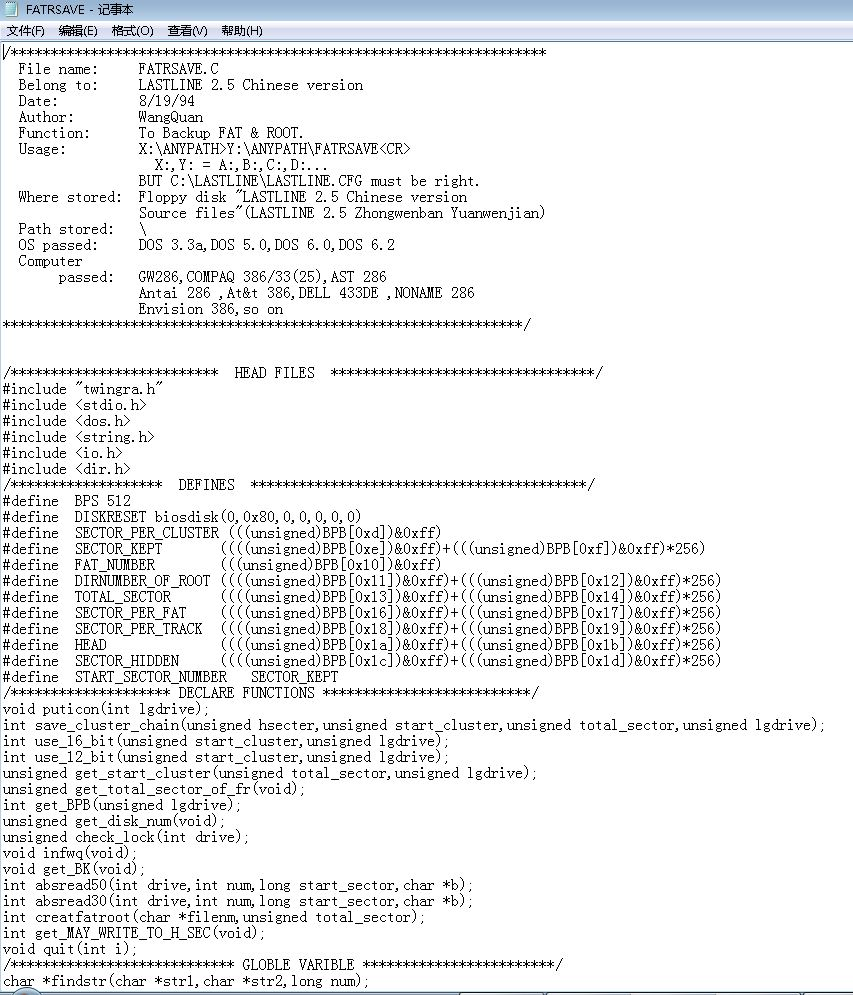
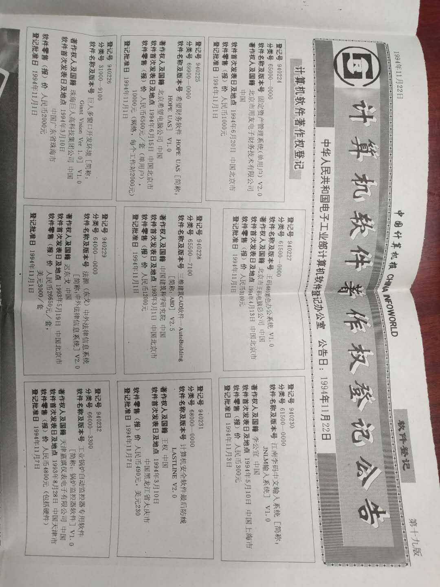
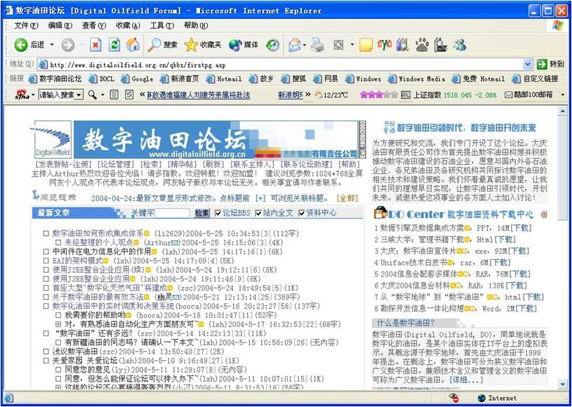
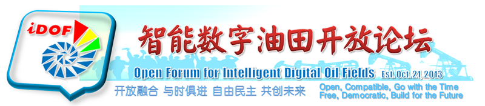
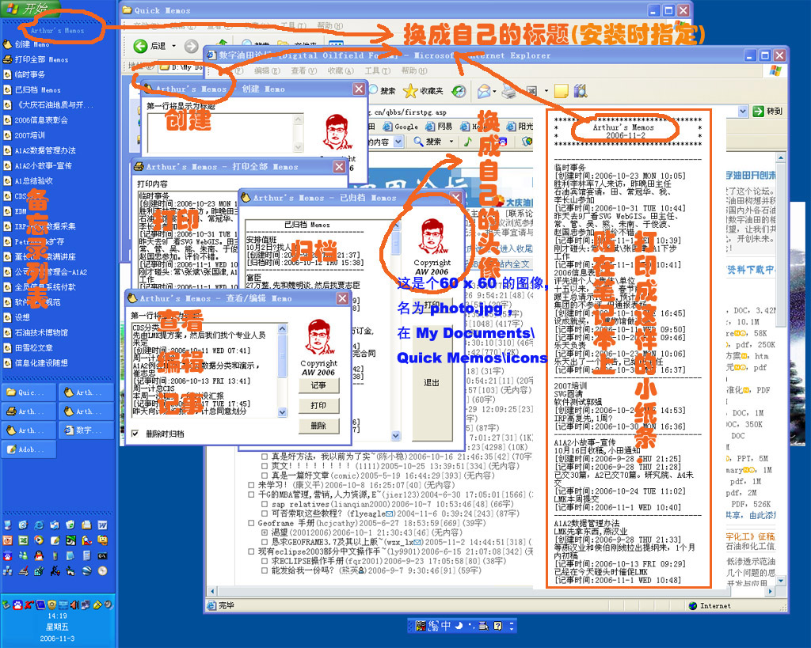
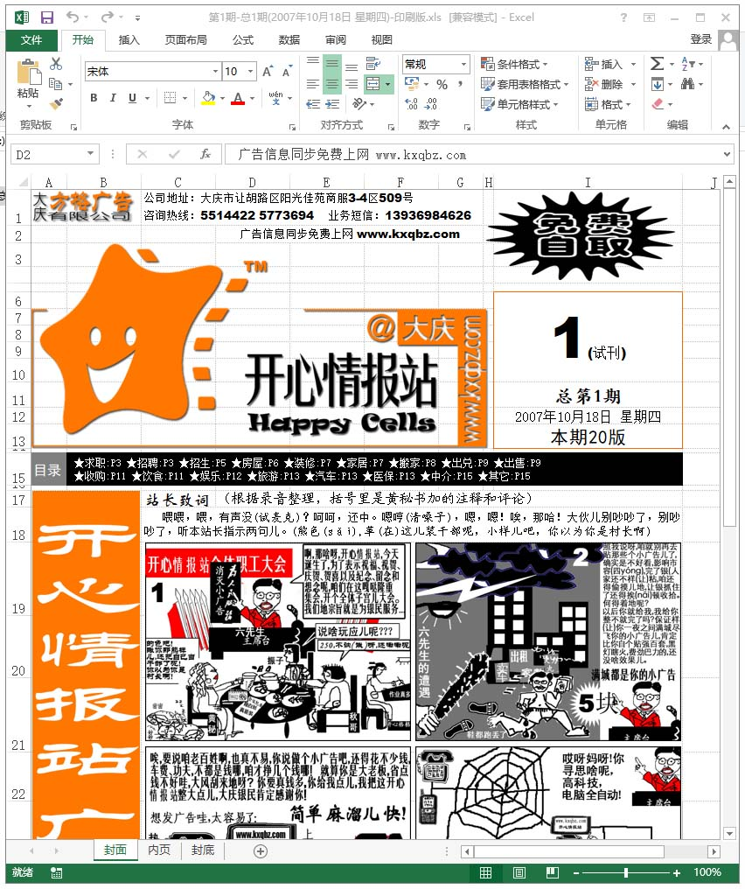
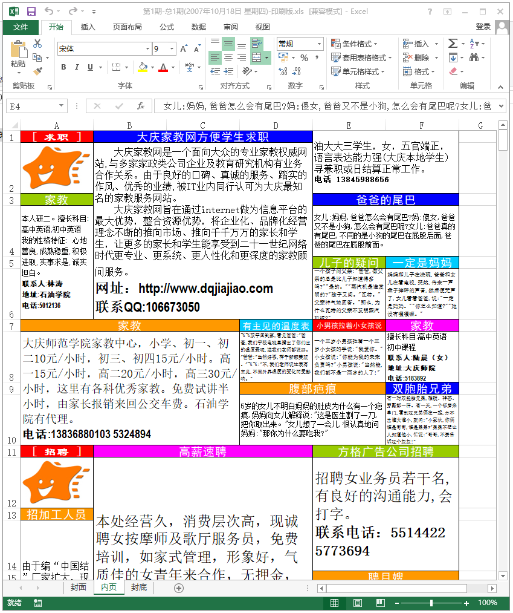
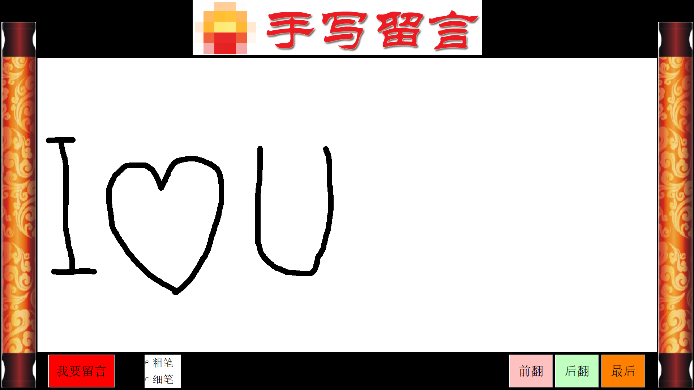

# 阿色的程序猿生

阿色编写的最早的程序是在1987年的大学时代，主要是FORTRAN实现的一些算法程序，在当时比较牛的小型机VAX-3500和微机IBM-PC上运行。

1990年，毕业设计编写了地震勘探剖面图、速度谱等图件的绘制程序。该程序使用FORTRAN语言，调用绘图软件包，在当时非常高级的BENSON喷墨绘图仪和行式针式打印机上绘图。

1990年，阿色开始学习Quick BASIC和Turbo C，以及Unix（SunOS）的C语言编程，主要写一些解决实际生产问题的小型程序，包括地震勘探人工合成记录、声波时差/视电阻率曲线矫正、VSP解释处理、物探算法等程序。

1991年开始大量使用C和汇编语言，1993年开始使用dBase、ORACLE/SQL进行数据库开发，建立了物探数据库和GIS系统。当时，为了解决图形查询问题，我们创造了图形查询语言GSQL。

后来，随着IT技术的发展，相继学习使用过VB、VBA、LISP、FoxBase、C++、C#、HTML、CGI、Java、JavaScript、ASP、PHP、...、Python等。

完成的大部分代码已经遗失，本仓库保存的是从软盘中抢救出来的早期的一些代码，主要包括：

## 1 最后防线(Lastline)和其他早期程序
存储在 Lastline_and_DOS_Era_Floppy_Disk_Recover 文件夹。

最后防线(Lastline)是1993年使用Turbo C 和汇编语言编写的计算机安全防御软件，主要功能是DOS系统的全硬盘数据恢复。

这个软件相当神奇，它可以把硬盘数据最大限度地恢复，只要不是物理级的损毁或擦除，均可恢复，即使操作系统完全崩溃也没问题。

最神奇的是：它把用于恢复的数据保存在同一块硬盘上，而这块硬盘完蛋后，却可以从这块已经完蛋的硬盘上搜集恢复数据，最后把整个硬盘数据恢复，包括DOS操作系统本身。这就相当于用自己的刀削自己的把儿。

其原理是：把硬盘的分区表、引导区、文件分配表等信息存储在硬盘上的缝隙扇区中，并保存多个位置，只要能找到一个恢复数据即可。

现在看这是一种全息思想，只是当时年轻的阿色还不懂这个。

该软件获得了软件制作权，在那个年代这是本地区的第一个。

  
  

阿色发现那时的程序注释较少，而且宁可使用拼音也不使用汉字。原因是为了节省磁盘空间？可能还是编程文化与现在不同吧？

本文件夹还包括其他早期程序，都是些什么已经记不太清了，只记得那时经常要进行字节级、位级的操作，还要用汇编直接操作CPU寄存器、BIOS中断、VGA内存区、磁盘扇区等。

## 2 数字油田论坛网站 / 智能数字油田开放论坛资料
存储在 Digital_Oilfield_Forum_Website 文件夹。

2003年，阿色独立开发、建立【数字油田论坛】网站，并自任主持人。

该网站持续运营约十年，在数字油田业界具有强大影响力。

该网站主要使用ASP+Access开发，具有BBS、专家中心、资料中心、全站全文检索、用户互联等功能。

  

阿色使用Flash制作的数字油田宣传片源文件也包含在此文件夹中。点击下面链接可观看转录的视频： 
https://www.iqiyi.com/v_19rtuydpgh.html

后来随着因特网的发展，以此网站为基础，转型开创线上线下一体化的智能数字油田开放论坛(iDOF)。 
iDOF相关资料也包含在本文件夹中，包括阿色亲自设计的Logo、理念、说明、网站原型界面，以及其他相关资料。 

  

## 3 任务管理系统(TaskMng)
存储在 taskmng 文件夹中。

本系统是阿色带领团队基于B/S模式开发的软件产品，是为加强团队协作而建立的任务管理系统，曾大规模应用于阿色供职的超大企业和其下属企业，以及外部用户单位。

本系统后台数据库为SQL Server（通过对少量的数据库函数的修改，可以运行于各种类型的数据库）；编程主要采用ASP技术。

系统运行环境：操作系统为Windows NT4.0，(IIS3.0+ASP)/IIS4.0(自带ASP)/(SP4+ASP)(即可运行ASP)，为了对系统作最少的改动即可在目标服务器上运行，建议使用工作平台为IIS 4.0，数据库为SQL Server 6.5／SQL Server 7，程序运行的中间件为ODBC。

当时，该系统的推行一方面是为了便于一个部门的管理工作，另一方便是为了更好地全面推行ASP及SQLServer等新技术，以加快企业网建设的步伐。

  

## 4 Quick Memos
存储在 QuickMemos 文件夹。

这是使用VB6编写的一个桌面记事工具。可以在桌面任务栏中显示，方便快速记事。

具有编辑、打印、归档，以及加急、加重标记等功能。

  

## 5 开心情报站(Happy Cells)
存储在 HappyCells 文件夹中。

这是阿色2007年指导的一个广告业创意项目。那时，移动互联网还没有起来。

项目内容： 
创办一个小报，内容是广告和笑话等趣味材料，同时开通网站，同步刊登网络版小报。 
纸质小报送到各个餐馆、商场等人群聚集地，免费索取，网络版免费浏览并自动接收广告业务。 
用户可以在网页上自行编辑、设计其广告内容，当然也可线下联系。 
根据用户定义和业主要求，自动生成小报的纸质版和网页版的排版，并自动上传。 
同时支持各地连锁经营。

上述功能已经全部实现。

云端使用ASP实现网络版，本地使用VBA在MS Excel中实现自动排版，并生成html文件用于网络版。使用VBA封装技术，实现了EXE文件直接运行，不需要在Excel中启动VBA。  

  
  
  
  

## 6 手写留言板
存储在 handwriteboard 文件夹中。

这是阿色2009年用VB写的一个在触目屏电视上手写留言小程序。也可以用鼠标写。

记得当时非常紧急，晚上用两小时完成的，现在可能还在用。  

  

    

* 说明：上述代码均为阿色和有关人员业余时间所写的个人成果，与单位相关的代码也已经过期作废并已脱密公开，不涉及任何版权问题。若对阿色及团队的本职工作成果感兴趣，请联系本人或本人单位按对公业务处理。